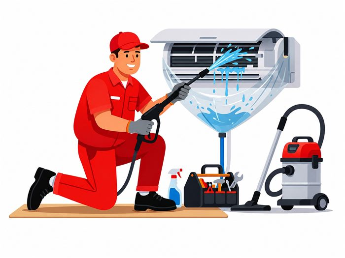

# ProCraftX.ae — Technical SEO Audit
**Crawled:** 1 Aug 2026 | **Method:** direct HTTP fetch + HTML parse (not a third-party tool)
**Host:** Vercel (edge region `bom1` / Mumbai) | **Pages crawled:** 2 (the entire site)

---

## CORRECTION TO MY PREVIOUS REPORT

My first analysis said *"No meta descriptions — none of your pages have one."*
**That was wrong.** It was based on a page-summarizer that didn't expose `<head>`.
Raw HTML shows you **do** have meta descriptions, Open Graph, Twitter cards, canonical
tags and JSON-LD. Your `<head>` is actually better built than most of your competitors'.
The real problems are different, and listed below.

---

## SEVERITY 1 — FIX THIS WEEK

### 1.1 `www.procraftx.ae` has no valid SSL certificate — visitors see a security warning

Verified by reading the certificate directly:

```
$ openssl s_client -connect www.procraftx.ae:443 -servername www.procraftx.ae
subject=CN=procraftx.ae
X509v3 Subject Alternative Name:
    DNS:procraftx.ae          <-- www.procraftx.ae is NOT covered
```

DNS resolves `www` (CNAME → apex), and the server *would* redirect (`307 → https://procraftx.ae/`),
but **the TLS handshake fails before the redirect is ever reached.** A plain request returns
connection code `000`.

**Re-verified 1 Aug 2026 across three independent TLS stacks** (a single client could be
lying; three agreeing cannot):

| Client | Result |
|---|---|
| curl / Windows schannel | exit 60 — `SEC_E_WRONG_PRINCIPAL`, target principal name is incorrect |
| openssl `-verify_hostname www.procraftx.ae` | `verify error:num=62: hostname mismatch` |
| Python `ssl` (default context) | `certificate is not valid for 'www.procraftx.ae'` |
| **Control — same checks on apex** | **all pass, `Verify return code: 0 (ok)`** |

The certificate itself is healthy: Let's Encrypt, chain verifies to ISRG Root X1,
valid `Jul 18 2026 → Oct 16 2026`. It just doesn't list `www` in its SAN.

There is no working path in either scheme — `http://www.procraftx.ae` returns
`308 → https://www.procraftx.ae/`, which lands directly in the cert failure.

**The HSTS interaction makes this worse for your best customers.** The apex sends
`Strict-Transport-Security: max-age=63072000; includeSubDomains; preload`. Checking the
actual preload list, `procraftx.ae` is **not** on it (`status: unknown`) — so:

- **First-time** visitor typing `www`: standard cert warning *with* an "Advanced → Proceed"
  bypass. Few will use it, but it exists.
- **Anyone who previously visited `https://procraftx.ae`**: their browser cached the HSTS
  policy with `includeSubDomains` for **two years**. Chrome shows a **non-bypassable**
  error — no proceed option at all.

Repeat customers and referrals — the people most likely to type the domain from memory —
get the hardest failure.

**Calibrated impact.** Being precise about severity:
- **Ranking impact: minimal.** Nothing links to `www`, so Google isn't indexing it. No
  duplicate-content or split-equity problem exists *today*.
- **Conversion/trust impact: real.** Anyone typing `www`, any printed material or forwarded
  link using `www`, and any future inbound `www` link is a dead end.

This is a **conversion defect, not a ranking defect.** It stays at the top of the list
because it costs ~2 minutes to fix, not because it is suppressing rankings. The real
ranking blocker is §1.2 below.

**Fix:** Vercel → Project → Settings → Domains → add `www.procraftx.ae` as a domain.
Vercel auto-provisions the SAN and applies a redirect to the apex. Then re-verify:
```bash
python -c "import ssl,socket;ctx=ssl.create_default_context();s=ctx.wrap_socket(socket.create_connection(('www.procraftx.ae',443)),server_hostname='www.procraftx.ae');print('OK',s.getpeercert()['subjectAltName'])"
```

### 1.2 Two URLs exist. That is the entire site.

```
$ curl https://procraftx.ae/sitemap.xml
https://procraftx.ae/
https://procraftx.ae/faq.html
```

`<a>` link analysis of the homepage:

```
total links      41
internal paths    0     <-- ZERO
#anchors         31
external          5
tel/mail/whatsapp 6
```

**Zero internal path links.** All 31 navigation links are `#section` jumps on the same page.
There is nothing for Googlebot to crawl to. 17 services share one URL, so they cannibalise
each other and Google assigns the page a single topic.

This is the #1 cause of your ranking gap. Everything else on this list is secondary to it.

### 1.3 The LCP image is lazy-loaded — a direct Core Web Vitals penalty

All 29 images carry `loading="lazy"`, **including the first image in the document**:

```
img0 lazy=True  fetchpriority=False  width/height=False
img1 lazy=True  fetchpriority=False  width/height=False
img2 lazy=True  fetchpriority=False  width/height=False
img3 lazy=True  fetchpriority=False  width/height=False
```

Lazy-loading the Largest Contentful Paint element defers its request until after layout,
which is one of the most reliable ways to fail the LCP threshold. Google explicitly
advises against it.

**Fix** — on the hero/first visible image only:
```html

```
Keep `loading="lazy"` on everything below the fold.

Also add to `<head>`:
```html
<link rel="preload" as="image" href="/assets/images/ac-service.jpg" fetchpriority="high">
```

### 1.4 No `width`/`height` on any of 29 images — layout shift (CLS)

`explicit w/h: 0` across all 29. Every image reserves zero space until it loads, so the page
reflows as each one arrives. This fails CLS on mobile, which is where most UAE service
searches happen.

**Fix:** add intrinsic `width` and `height` attributes to all 29 `` tags. CSS can still
resize them (`style="width:100%;height:auto"`) — the attributes only supply the aspect ratio.

---

## SEVERITY 2 — FIX THIS MONTH

### 2.1 Title tag is 83 characters — truncated in results

```
Current (83): AC, Plumbing, Electrical & Home Maintenance Services in Dubai & Sharjah | Procraftx
```
Google truncates around 60 characters / 580px. Everything after "Dubai" is invisible,
including your brand name.

```
Suggested (57): Home Maintenance Dubai & Sharjah | AC, Plumbing | ProCraftX
```

### 2.2 Meta description is 232 characters — truncated at ~155

```
Current (232): Procraftx covers AC, plumbing, electrical, handyman, furniture care, and home
clearing & sanitization. Based in Dubai and Sharjah, also serving Ajman and Abu Dhabi.
Free walkthrough, flat quote, 100% guarantee. Call 050 791 7075.
```
Your phone number — the most valuable part — is cut off.

```
Suggested (152): AC, plumbing, electrical & handyman services across Dubai & Sharjah.
Free walkthrough, flat quote before we start, 100% guarantee. Call 050 791 7075.
```

### 2.3 LocalBusiness schema is missing its most valuable properties

Present: `HomeAndConstructionBusiness` with `name, url, telephone, email, description,
areaServed, priceRange, sameAs`.

**Missing — and these are what generate rich results:**

| Missing property | What it unlocks |
|---|---|
| `address` (PostalAddress) | Local pack eligibility. **Most important omission.** |
| `geo` (latitude/longitude) | Proximity ranking |
| `openingHoursSpecification` | "Open now" label in results |
| `aggregateRating` + `review` | ★★★★★ stars in results — biggest CTR gain available |
| `hasOfferCatalog` / `Service` | Service-level rich results |
| `image` / `logo` | Knowledge panel |

You already display customer reviews on the page but they are **not marked up**, so Google
cannot show stars. wewillfixit shows 4.7★ from 2,000+ reviews in the SERP. You show nothing.
Ready-to-paste schema is in `procraftx-content-optimization.md`.

### 2.4 `faq.html` — drop the file extension

`https://procraftx.ae/faq.html` → `https://procraftx.ae/faq/`
On Vercel add to `vercel.json`:
```json
{ "cleanUrls": true, "trailingSlash": true }
```
Then 301 the old URL. Flat `.html` signals a static brochure, and it constrains your
future URL scheme.

### 2.5 No WebP/AVIF

```
<picture> elements: 0 | .webp refs: 0 | .jpg/.png refs: 32
```
Total image payload is **1.12 MB across 29 files** (largest 91 KB) — genuinely not bad,
so this is lower priority than I'd normally rank it. WebP would still cut ~30-40%.

### 2.6 `www` redirect is 307 (temporary), should be 308/301

Once the certificate is fixed, make the redirect permanent so link equity consolidates
on the apex domain.

---

## SEVERITY 3 — WORTH DOING

| Issue | Detail | Fix |
|---|---|---|
| No Arabic version | `<html lang="en">`, no `hreflang`. ~40% of UAE residential searches run in Arabic. | Add `/ar/` + `hreflang="ar-AE"` / `en-AE` / `x-default` |
| No `geo` meta | Minor reinforcement signal | `geo.region=AE-DU`, `geo.placename=Dubai` |
| No breadcrumbs | Once you build service pages | `BreadcrumbList` schema |
| No blog | Competitor `wewillfixit` at 394 keywords is mostly blog-driven | Add `/blog/` |
| No sitemap index | Only 2 URLs today | Regenerate on every deploy |
| CSP blocks analytics | `script-src 'self'` + hashes — GA4/GTM will be **blocked** | Add GA domains to CSP *before* installing analytics |

**Note on 2.6/CSP:** your Content-Security-Policy is strict and well configured
(`object-src 'none'`, `frame-ancestors 'none'`, HSTS preload). That is genuinely good
security work. But it *will* silently block Google Analytics and Tag Manager when you add
them. Budget for that.

---

## WHAT IS ALREADY CORRECT

Worth stating plainly, because these are real and several competitors get them wrong:

- Valid canonical tags on both pages
- Complete Open Graph + Twitter Card markup
- `FAQPage` JSON-LD on `/faq.html` — eligible for FAQ rich results
- **All 29 images have alt text** — zero missing, better than most sites
- Correct `<meta charset="UTF-8">`, no encoding corruption
- Mobile viewport present
- HTTPS with HSTS preload, correct `308` on http→https
- Proper `404` on unknown URLs (no soft-404s)
- TTFB **0.29s**, `X-Vercel-Cache: HIT` — hosting is fast
- Single `<h1>` per page, sane heading hierarchy
- Reasonable image weights (1.12 MB total, largest 91 KB)

Your foundation is solid. **You are not losing to a broken site — you are losing to a
site that only has one page.**

---

## PRIORITY ORDER

1. Add `www` domain in Vercel (2 min) — stops turning visitors away at a security warning
2. Split into service pages + real internal links (the whole ballgame)
3. `loading="eager"` + `fetchpriority="high"` on hero image; `width`/`height` on all 29
4. Expand LocalBusiness schema — add `address`, `openingHours`, `aggregateRating`
5. Trim title to ~57 chars, meta description to ~155
6. `cleanUrls` on Vercel, 301 `faq.html` → `/faq/`
7. Google Search Console + Bing Webmaster, submit sitemap
8. Google Business Profile — separate listings for Dubai and Sharjah
